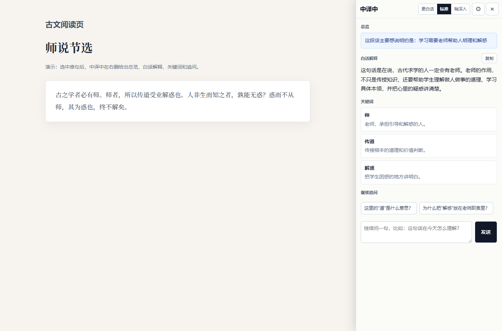
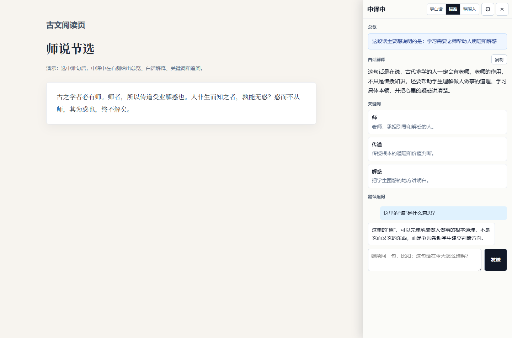
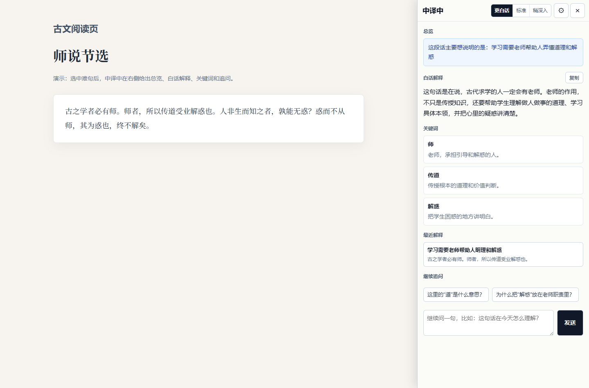

# 中译中

“中译中”是一个 Chrome/Edge 浏览器插件。第一版支持在网页中选中一段晦涩中文，然后用你自己配置的大语言模型 Key 生成：

- 一句话总览
- 白话解释
- 关键词解释
- 流式继续追问
- 更白话 / 标准 / 稍深入三档解释
- 复制总览和白话解释
- 当前页面最近解释

## 效果预览

选中难懂中文后，右侧会先给一句总览，再给白话解释和关键词。

追问也支持流式输出，可以围绕当前原文继续问。

支持“更白话 / 标准 / 稍深入”三档解释，并保留当前页面最近解释。

## 安装

1. 打开 Chrome 或 Edge 的扩展管理页。
2. 开启“开发者模式”。
3. 选择“加载已解压的扩展程序”。
4. 选择本项目目录。
5. 在扩展详情页打开“扩展程序选项”，填写 API Key。

## 默认模型配置

默认使用 DeepSeek 的 OpenAI-compatible 接口：

- Base URL: `https://api.deepseek.com`
- Model: `deepseek-chat`

也可以改成 OpenAI 或其他兼容 `/chat/completions` 的模型服务，例如：

- Base URL: `https://api.openai.com/v1`
- Model: `gpt-4.1-mini`

API Key 只保存在浏览器本地的 `chrome.storage.local` 中。

## 使用

1. 打开任意网页。
2. 选中一段中文。
3. 如果右侧还没有翻译结果，会自动开始解释，并边生成边显示。
4. 如果右侧已经有翻译结果，新选区不会清掉旧结果；要切换到新选区，请点击选区旁边的“中译中”按钮。
5. 也可以选中文本后点击浏览器工具栏里的“中译中”图标，或右键选择“用中译中解释”。
6. 在右侧面板查看总览、白话解释和关键词。
7. 如果解释太绕或太浅，可以切换“更白话 / 标准 / 稍深入”。
8. 点击“复制”可以复制总览和白话解释。
9. 在底部输入框继续追问，回答会流式显示。
10. 在“最近解释”里回看当前页面刚解释过的内容。

## 速度建议

- 选择响应快的模型会最明显，比如 DeepSeek、OpenAI mini 系列或其他低延迟模型。
- 设置页里的“最大输出 token”越小，通常越快。默认是 `700`，想更快可以调到 `500` 左右。
- 同一段文字重复解释会优先使用当前浏览器会话内的缓存。
- 第一轮解释默认使用流式输出，模型生成时会逐步显示，不需要等全部内容返回。
- 选中的原文越长，请求越慢。第一版建议一次选一小段。

## 第一版边界

这一版不做“历代名家注释”和出处检索，避免模型编造来源。后续可以接入可靠古籍数据库，再做带来源的注释和多家解释对照。
